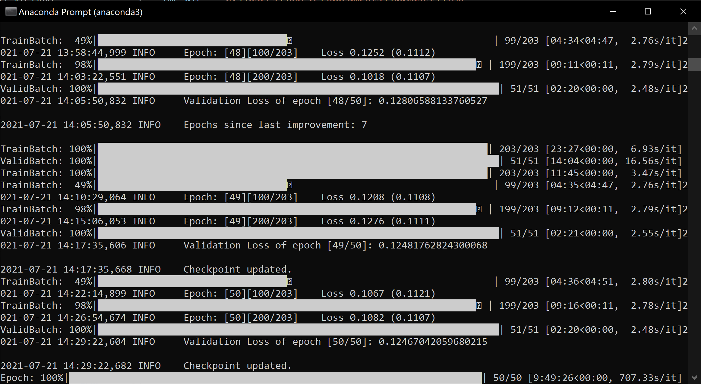
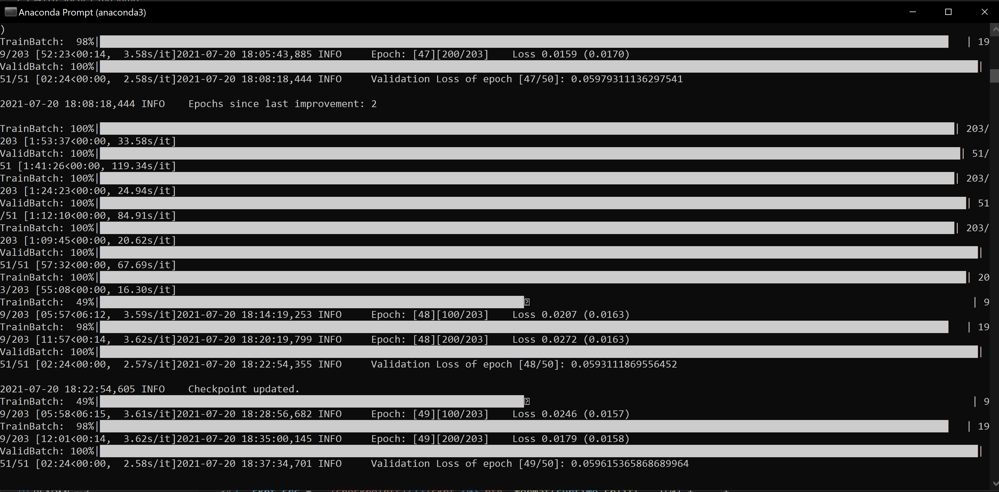
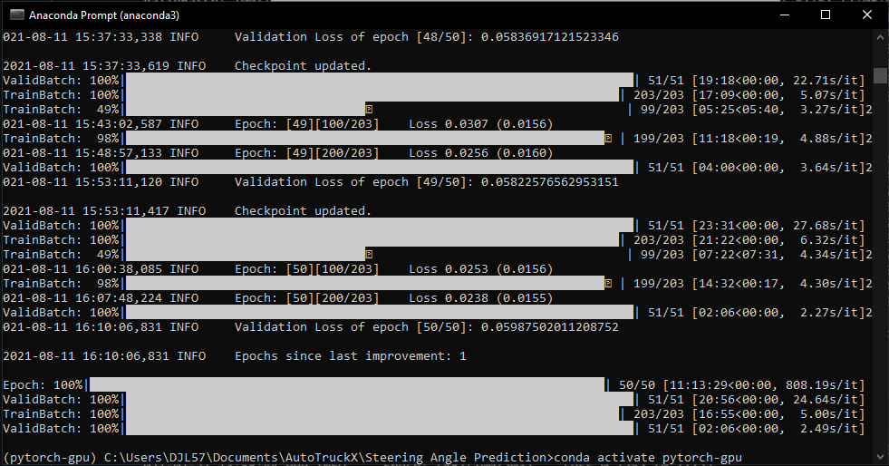
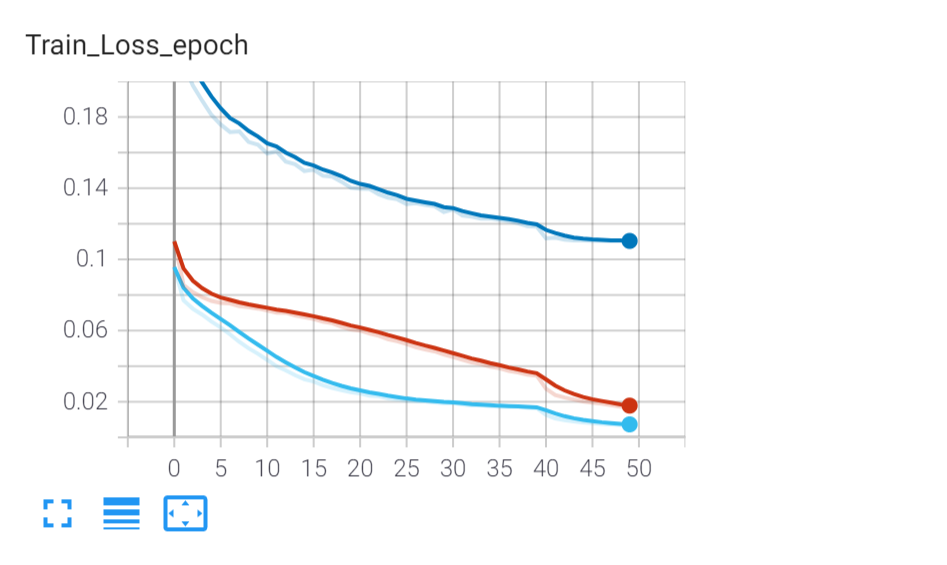
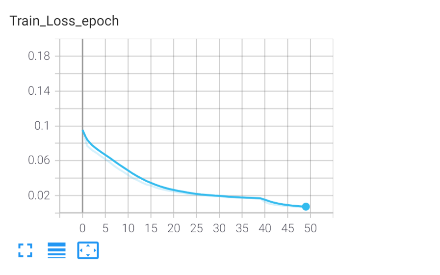
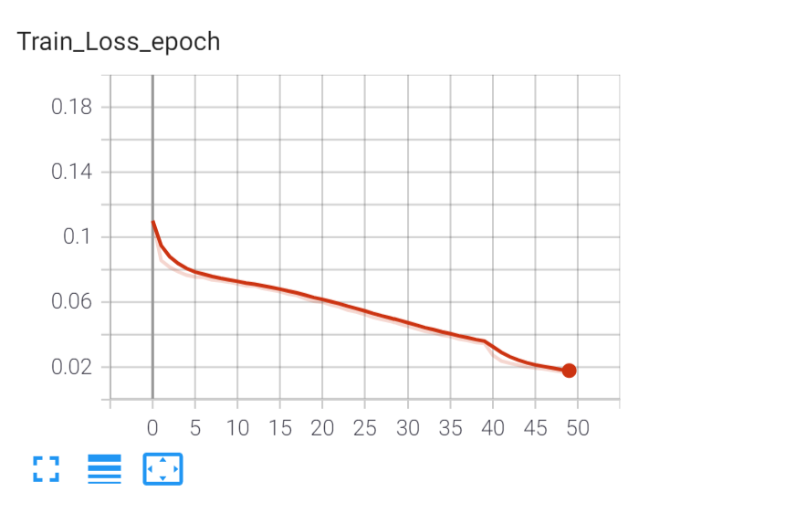
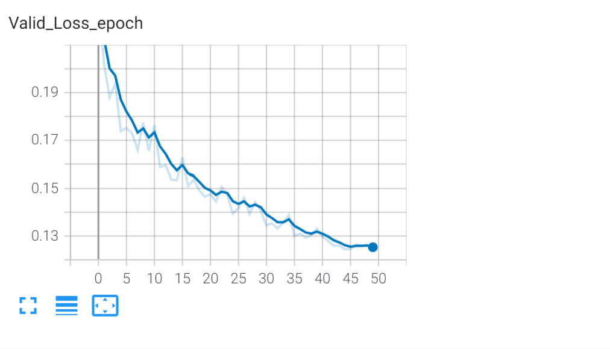
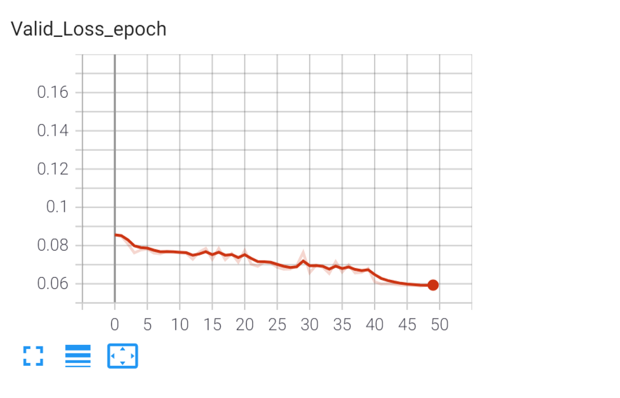

# Steering Angle Prediction

## Model Architecture ##

Three models were experimented:
* TruckResnet18: Lighter version of Resnet50. Has 18 Layers. 
* TruckResnet50: A CNN transfer learning model utilizing feature maps extracted by ResNet50, connected to additional fully-connected layers. This model was adapated and modified from Du et al.'s 2019 paper [*Self-Driving Car Steering Angle Prediction Based on Image Recognition*](https://arxiv.org/abs/1912.05440). The first 141 layers of the ResNet50 layers (instead of the first 45 layers as in the original paper) were frozen from updating. Dimensions of the fully-connected layers were also modified.
* GoogLeNet: Is based on a CNN architecture codenamed "Inception". 

| TruckResnet18 | TruckResnet50 | GoogLeNet |
| ------------- | ------------- | ------------- |
|   |   | |

Resnet50 and Resnet18 figures are extracted from their original papers respectively. GoogLeNet figure was pulled from pytorch.org.   

## Regression Loss ##

The loss function is the standard MSE loss between the predicted and groundtruth steering angles, as implemented in [torch.nn.MSELoss](https://pytorch.org/docs/stable/generated/torch.nn.MSELoss.html). For all three models, the mean of all tensor elements' MSE loss was used.

## Dataset ##

The models were trained on driving scene images simulated and extracted from [Udacity's self-driving car simulator](https://github.com/udacity/self-driving-car-sim). The [dataset (~1.35GB)](https://www.kaggle.com/zaynena/selfdriving-car-simulator) contains 97330 images (320x160) with steering angles labelled. 

## Training ##

Models were trained on Nvidia RTX 2070 using Anaconda.

OS: Windows 10 Pro version 21H1

All three models were trained with 50 epochs, 1e-4 learning rate and batch size is set to be 128.

## Results and Visualization ##

The best validation loss observed is 0.058 MSE from TruckResnet50, which is better than Resnet18 and standard GoogLeNet. Orignial Run: [Click Here](./visualizations/Resnet50_50_Epoch.png)

The best validation loss observed is 0.124 MSE from TruckResnet18, which is the worse out of the three models.

The best validation loss observed is 0.059 MSE from GoogLeNet. This almost matches TruckResnet50. This is big because resnet50 is a much larger model. A massive improvement to efficiency by using GoogLeNet over TruckResnet50.

The best validation loss observed is 0.058 MSE from GoogLeNet with 2 added modules per inception step. This beats TruckResnet50 slighly. This helps prove that GoogLeNet is more efficient than TruckResnet50 when it comes to Validation loss. 

| Models Comparison | All Models(50 Epochs) | TruckResnet50 (50 Epochs) | TruckResnet18 (50 Epochs) | GoogLeNet (50 Epochs) |
| ------------- | ------------- | ------------- | ------------- | ------------- |
| Train  |   |   |   | 
| Validation   |   |   |   |   |

| TruckResnet50 vs GoogLeNet With Added Modules Validation Comparison |
| ------------- | 
|  |

* All Model graphs were obtained by using Tensorboard

## Model Training and Testing Instructions ##

* Pretrained checkpoint for TruckResnet50 can be downloaded via this [link](https://drive.google.com/file/d/1Z1yOd6AvhJ3fTfvIvRiNeF8fq8xKdfLA/view?usp=sharing). 
* Pretrained checkpoint for TruckResnet18 can be downloaded via this [link](https://drive.google.com/file/d/1qh1CmUuj-f81m5yGcQKkoXOOflTwu6GV/view?usp=sharing). 
* Pretrained checkpoint for GoogLeNet can be downloaded via this [link](https://drive.google.com/file/d/1983XhUgrq4ijwB-TeXDaq3wBhTcaEpNJ/view?usp=sharing). 

For usage, proceed to place it to `./checkpoints/model_name/best_ckpt_1.pth`. Please Note: `mode_name` refers to `TruckResnet18`, `TruckResnet50`, and `GoogLeNet`. Must add own `checkpoints` folder.

* Set up all configurations in `config.py`.
* To train networks, `python train.py`.
* To inference networks on test images, `python inference.py`.
* To visualize with extra graphs, `python visualize.py`.
* To observe training history in tensorboard, `tensorboard --logdir runs`.

## Known Issues ##

* When running on windows, a thread error can occur due to windows having poor parrallel computing. Fix: run this command `python train.py --workers 0`
* Due to the originals RNN models, training uses CPU heavily. This has not be fully optimized to use cuda only. 
* Some files may not work correctly due to some parts being loaded on the GPU and others loaded onto CPU.

## Acknowledgement and Reference ##

* NVIDIA 2016 paper [*End to End Learning for Self-Driving Cars*](https://arxiv.org/abs/1604.07316).
* Du et al.'s 2019 paper [*Self-Driving Car Steering Angle Prediction Based on Image Recognition*](https://arxiv.org/abs/1912.05440), and its [affiliated repo](https://github.com/FangLintao/Self-Driving-Car).
* Manajit Pal's *towards data science* tutorial [*Deep Learning for Self-Driving Cars*](https://towardsdatascience.com/deep-learning-for-self-driving-cars-7f198ef4cfa2), as well as its [affiliated repo](https://github.com/ManajitPal/DeepLearningForSelfDrivingCars).
* Aditya Rastogi's *Data Driven Investor* tutorial [*Visualizing Neural Networks using Saliency Maps*](https://medium.datadriveninvestor.com/visualizing-neural-networks-using-saliency-maps-in-pytorch-289d8e244ab4).
* Zhenye Na's *Self-Driving Car Simulator* [dataset on Kaggle](https://www.kaggle.com/zaynena/selfdriving-car-simulator).
* Resnet18 model picture was extracted from: *A Deep Learning Approach for Automated Diagnosis and Multi-Class Classification of Alzheimer’s Disease Stages Using Resting-State fMRI and Residual Neural Networks*(DOI:10.1007/s10916-019-1475-2)
* https://pytorch.org/hub/pytorch_vision_resnet/
* https://pytorch.org/hub/pytorch_vision_googlenet/
* https://www.anaconda.com/
